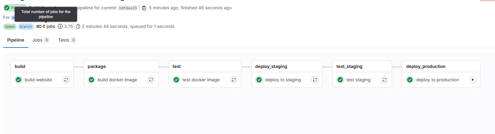

# React App CI/CD Pipeline with GitLab and AWS

This project demonstrates a complete CI/CD pipeline for deploying a React application using GitLab CI/CD and AWS services.

##  Tech Stack

- **React** – Frontend application
- **GitLab CI/CD** – Pipeline orchestration
- **Docker** – Containerization of the app
- **AWS S3** – Static website hosting for staging
- **AWS Elastic Beanstalk (EB)** – Production deployment
- **AWS EC2 & IAM** – Infrastructure and access control

---

##  Pipeline Overview

### 1. Build Stage
- Installs dependencies
- Runs linter and unit tests
- Builds React app to the `/build` directory

### 2. Package Stage
- Builds a Docker image using `Dockerfile`
- Pushes it to gitLab container registry

### 3. Test Docker Image
- Spins up the image
- Verifies the `/version.html` endpoint contains the correct build ID

### 4. Deploy to Staging (S3)
- Syncs the contents of `build/` to an S3 bucket (`dulith-2025514-staging`)
- App is available at:
  ```
  http://dulith-2025514-staging.s3-website-us-east-1.amazonaws.com
  ```

### 5. Test Staging
- Hits the `version.html` file on the staging URL to verify the correct build

### 6. Deploy to Production (Elastic Beanstalk)
- Manual trigger from GitLab UI
- Creates a new application version on EB using `Dockerrun.aws.json`
- Updates the EB environment
- Production app is available at:
  ```
  http://mywebsite-env.eba-ftsbgqfk.us-east-1.elasticbeanstalk.com
  ```

---

##  Environment Variables (set in GitLab CI/CD Settings)

| Variable             | Purpose                           |
|----------------------|-----------------------------------|
| `CI_REGISTRY_USER`   | GitLab container registry login   |
| `CI_REGISTRY_PASSWORD` | GitLab container registry password |
| `GITLAB_DEPLOY_TOKEN` | Used for Docker auth in AWS      |
| `AWS_ACCESS_KEY_ID`  | IAM access key for AWS CLI       |
| `AWS_SECRET_ACCESS_KEY` | IAM secret key                  |
| `AWS_S3_BUCKET`      | Bucket for production EB deploy   |

---

##  Key Files

- `.gitlab-ci.yml` – Main pipeline configuration
- `Dockerfile` – Builds production-ready image (Nginx + React)
- `auth.json` – Docker registry authentication template
- `Dockerrun.aws.json` – Elastic Beanstalk container definition

---

##  Manual Deployment to Production
After confirming that staging is working:

1. Go to GitLab pipeline
2. Click the “play”  button on the `deploy to production` job
3. Monitor logs and verify deployment to EB

---

##  Notes
- Make sure all AWS services are in the same region (`us-east-1`)
- Use IAM roles with minimum required permissions
- S3 bucket must exist before deployment
- Beanstalk environment name must match `Mywebsite-env`

---

## Screenshot (optional)

